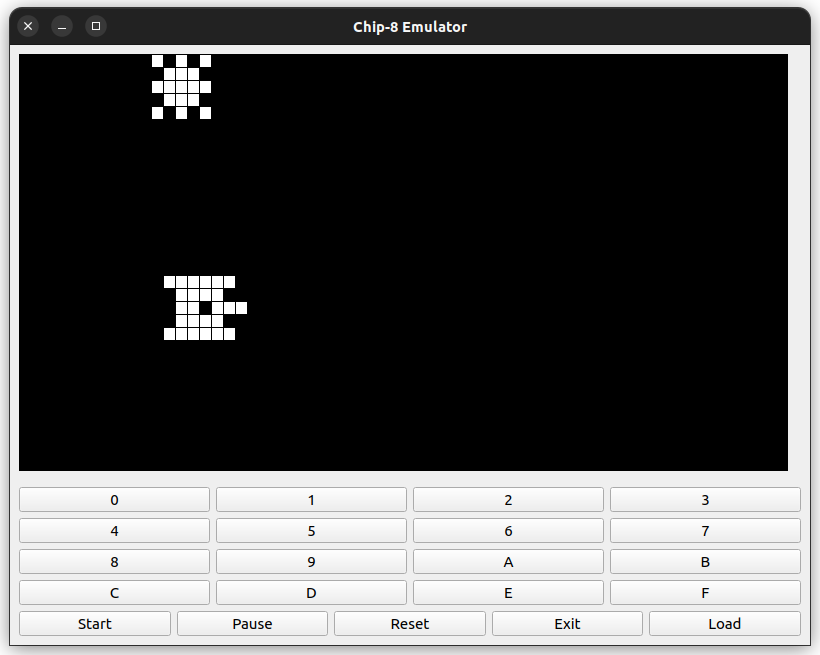

# chip-8 emulator



# overview 

This project is a simple chip-8 emulator in python capable of running chip-8 64*32 roms.
Inspired by: [this blog](http://omokute.blogspot.com/2012/06/emulation-basics-write-your-own-chip-8.html)

# installation

First install the python requirments:

```bash

python -m pip -r install requirements.txt

```

Some roms are available in the submodule.

# play !

```bash

python app.py

```

Then press **load** to load a rom, followed by **start**.

Enjoy !

